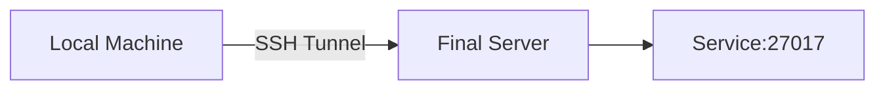
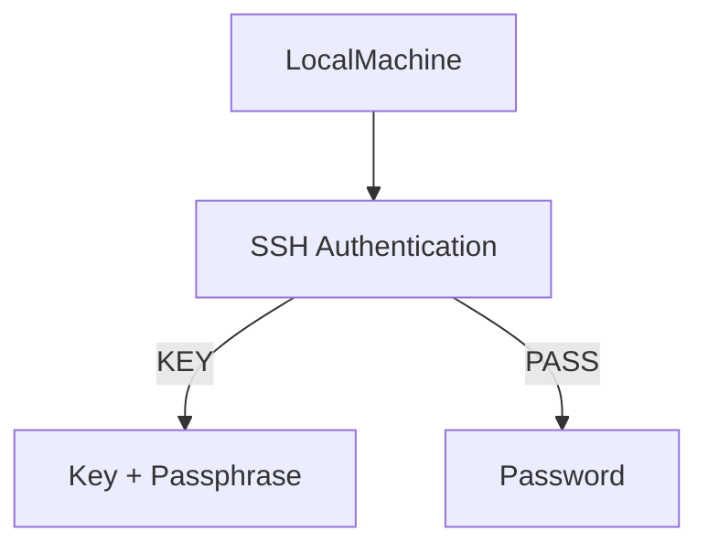

# telepath


Telepath is a modern, intelligent CLI tool for seamless and secure port forwarding.
Designed with versatility and ease of use in mind, Telepath enables developers and system administrators to create complex forwarding paths across multiple hosts effortlessly.
Whether you're working with password-based or keyfile authentication, single or multiple jump hosts, Telepath has you covered.

## Why Choose Telepath?
- Multi-Jump Host Support: Telepath allows seamless port forwarding through multiple intermediate hosts, making it ideal for accessing restricted networks.
- Secure Authentication: Supports password-based and keyfile authentication, ensuring flexibility and security.
- CLI Simplicity: Its intuitive command-line interface simplifies complex operations with straightforward commands.
- Daemon Mode: Runs as a background service for continuous operation, perfect for long-running port-forwarding tasks.
- Customizable & Open Source: It's open source and developer-friendly, so you can tweak it for your needs.

## Installation
Download and install executable binary from GitHub releases page.

### Using homebrew
```sh
brew tap tech-thinker/tap
brew install telepath
```

### Linux Installation
```sh
# Use latest tag name from release page
TAG=<tag-name>

curl -sL "https://github.com/tech-thinker/telepath/releases/download/${TAG}/telepath-linux-amd64" -o telepath
chmod +x telepath
sudo mv telepath /usr/bin
```

### MacOS Installation
```sh
# Use latest tag name from release page
TAG=<tag-name>

curl -sL "https://github.com/tech-thinker/telepath/releases/download/${TAG}/telepath-darwin-amd64" -o telepath
chmod +x telepath
sudo mv telepath /usr/bin
```

### Windows Installation
```sh
# Use latest tag name from release page
TAG=<tag-name>

curl -sL "https://github.com/tech-thinker/telepath/releases/download/${TAG}/telepath-windows-amd64.exe" -o telepath.exe
telepath.exe
```

### Verify checksum
```sh
# Use latest tag name from release page
TAG=<tag-name>

# Using sha256sum
curl -sL "https://github.com/tech-thinker/telepath/releases/download/${TAG}/checksum-sha256sum.txt" -o checksum-sha256sum.txt
sha256sum --ignore-missing --check checksum-sha256sum.txt

# Using md5sum
curl -sL "https://github.com/tech-thinker/telepath/releases/download/${TAG}/checksum-md5sum.txt" -o checksum-md5sum.txt
md5sum --ignore-missing --check checksum-md5sum.txt
```
Output:
```sh
telepath-darwin-amd64: OK
telepath-darwin-amd64.tar.gz: OK
telepath-darwin-arm64: OK
telepath-darwin-arm64.tar.gz: OK
telepath-linux-amd64: OK
telepath-linux-amd64.tar.gz: OK
telepath-linux-arm: OK
telepath-linux-arm.tar.gz: OK
telepath-linux-arm64: OK
telepath-linux-arm64.tar.gz: OK
telepath-windows-amd64.exe: OK
telepath-windows-i386.exe: OK
```

## CLI Guide
- `telepath` help
```sh
telepath -h
```

- Start tunnel using cli
```sh
telepath -f /etc/telepath/telepath.json
```

- Test tunnel configuration
```sh
telepath -f /etc/telepath/telepath.json --dry-run
```

## Run using Docker compose
You can run using docker compose and use it's internal network to access it.
```yaml
services:
  telepath:
    container_name: autossh
    image: ghcr.io/tech-thinker/telepath:latest
    networks:
      - telepath
    volumes:
      - ./myconfig:/etc/telepath

networks:
  telepath:
```

## Define Config file
The configuration file is a JSON array of objects. Each object defines a tunnel.

```json
[
  {
    "name": "mongodb",
    "type": "L",
    "localPort": 27017,
    "localHost": "0.0.0.0",
    "remotePort": 27017,
    "remoteHost": "0.0.0.0",
    "server": {
      "host": "final-host-ip",
      "port": 22,
      "username": "user",
      "authType": "KEY",
      "password": "",
      "key": "/etc/autossh/id_rsa",
      "passphrase": "passphrase",
      "jump": {
        "host": "jump-1-ip",
        "port": 22,
        "username": "user",
        "authType": "KEY",
        "password": "",
        "key": "/etc/autossh/id_rsa",
        "passphrase": "passphrase",
        "jump": {
          "host": "jump-2-ip",
          "port": 22,
          "username": "user",
          "authType": "KEY",
          "password": "",
          "key": "/etc/autossh/id_rsa",
          "passphrase": "passphrase"
        }
      }
    }
  }
]
```

### Fields Description

| Field           | Type           | Required | Description                                                                 |
|-----------------|----------------|----------|-----------------------------------------------------------------------------|
| `name`          | string         | ✅       | Identifier for the tunnel.                                                 |
| `type`          | string         | ✅       | Tunnel type: `L` for remote → local, `R` for local → remote.              |
| `localPort`     | number         | ✅       | Port on the local machine.                                                 |
| `localHost`     | string         | ✅       | Local host IP or `0.0.0.0` to bind all interfaces.                        |
| `remotePort`    | number         | ✅       | Port on the remote machine.                                                |
| `remoteHost`    | string         | ✅       | Remote host IP or `0.0.0.0`.                                              |
| `server`        | object         | ✅       | Final destination SSH server configuration.                                |
| `server.host`   | string         | ✅       | SSH server IP or hostname.                                                 |
| `server.port`   | number         | ✅       | SSH server port, usually 22.                                               |
| `server.username` | string       | ✅       | SSH username.                                                              |
| `server.authType` | string       | ✅       | Authentication type: `KEY` or `PASS`.                                     |
| `server.key`    | string         | 🔹       | Path to SSH key file if `authType` is `KEY`.                               |
| `server.password` | string       | 🔹       | Password if `authType` is `PASS`.                                         |
| `server.passphrase` | string     | 🔹       | Passphrase for the SSH key if required.                                    |
| `server.jump`   | object/null    | ❌       | Optional jump host configuration (recursive structure).                   |

> **Note:** Jump hosts are optional and can be nested multiple times.

### Tunnel Type
- **L (Local)**: Forwards traffic from **remote → local**  
- **R (Remote)**: Forwards traffic from **local → remote**

### Example Topology Diagram


- **A:** Your local machine
- **J1, J2:** Intermediate jump hosts
- **S:** Final SSH server
- **M:** MongoDB service running on the remote host

### Simple Tunnel Diagram (No Jump Hosts)


- **L:** Local machine
- **F:** Final SSH server
- **D:** Remote service (MongoDB, PostgreSQL, etc.)

### Authentication Flow
1. **KEY authentication**
   - Uses a private key (`key`) and optional `passphrase`.
2. **Password authentication**
   - Uses `password` field directly.



## Usage Notes
- You can have multiple tunnels defined in the JSON array.
- Jump hosts can be nested arbitrarily.
- Each tunnel should have a unique `name`.
- All ports and hosts are configurable to support complex network setups.
